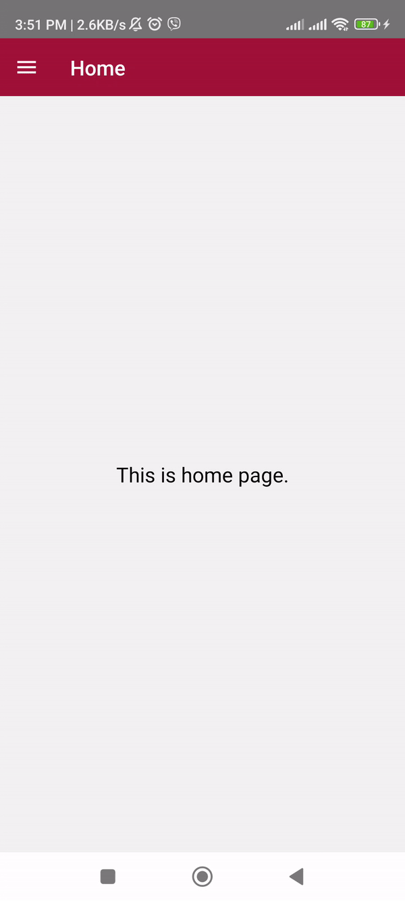

<h1>React Native Custom Drawer </h1>

## Step 1: First time need to install



````bash
# using npm
npm install


## Step 2 : Need to configure navigation

=> https://reactnavigation.org/docs/getting-started

=> npm install @react-navigation/native

=> npm install react-native-screens react-native-safe-area-context


## Step 3 : Need to configure react-native-gesture-handler

=> https://docs.swmansion.com/react-native-reanimated/docs/fundamentals/getting-started

=> npm install --save react-native-gesture-handler


## Step 4 : Need to configure react-native-reanimated

=> https://docs.swmansion.com/react-native-gesture-handler/docs/fundamentals/installation

=> npm install react-native-reanimated

=> Add react-native-reanimated/plugin plugin to your babel.config.js.

  module.exports = {
    presets: [
      ... // don't add it here :)
    ],
    plugins: [
      ...
      'react-native-reanimated/plugin',
    ],
  };


## Step 5 : Start the Metro Server

First, you will need to start **Metro**, the JavaScript _bundler_ that ships _with_ React Native.

To start Metro, run the following command from the _root_ of your React Native project:

```bash
# using npm
npm start

# OR using Yarn
yarn start
````

## Step 2: Start your Application

Let Metro Bundler run in its _own_ terminal. Open a _new_ terminal from the _root_ of your React Native project. Run the following command to start your _Android_ or _iOS_ app:

### For Android

```bash
# using npm
npm run android

# OR using Yarn
yarn android
```

### For iOS

```bash
# using npm
npm run ios

# OR using Yarn
yarn ios
```

If everything is set up _correctly_, you should see your new app running in your _Android Emulator_ or _iOS Simulator_ shortly provided you have set up your emulator/simulator correctly.

This is one way to run your app — you can also run it directly from within Android Studio and Xcode respectively.

## Step 3: Modifying your App

Now that you have successfully run the app, let's modify it.

1. Open `App.tsx` in your text editor of choice and edit some lines.
2. For **Android**: Press the <kbd>R</kbd> key twice or select **"Reload"** from the **Developer Menu** (<kbd>Ctrl</kbd> + <kbd>M</kbd> (on Window and Linux) or <kbd>Cmd ⌘</kbd> + <kbd>M</kbd> (on macOS)) to see your changes!

   For **iOS**: Hit <kbd>Cmd ⌘</kbd> + <kbd>R</kbd> in your iOS Simulator to reload the app and see your changes!

## Congratulations! :tada:

You've successfully run and modified your React Native App. :partying_face:
